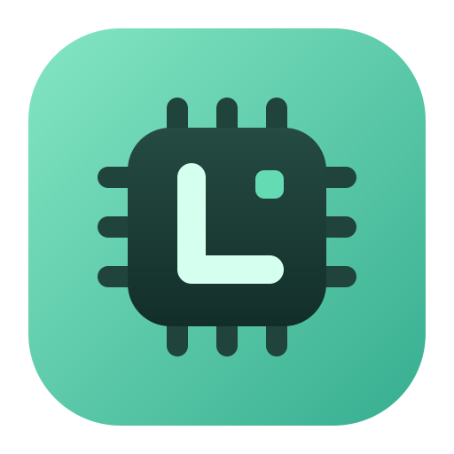
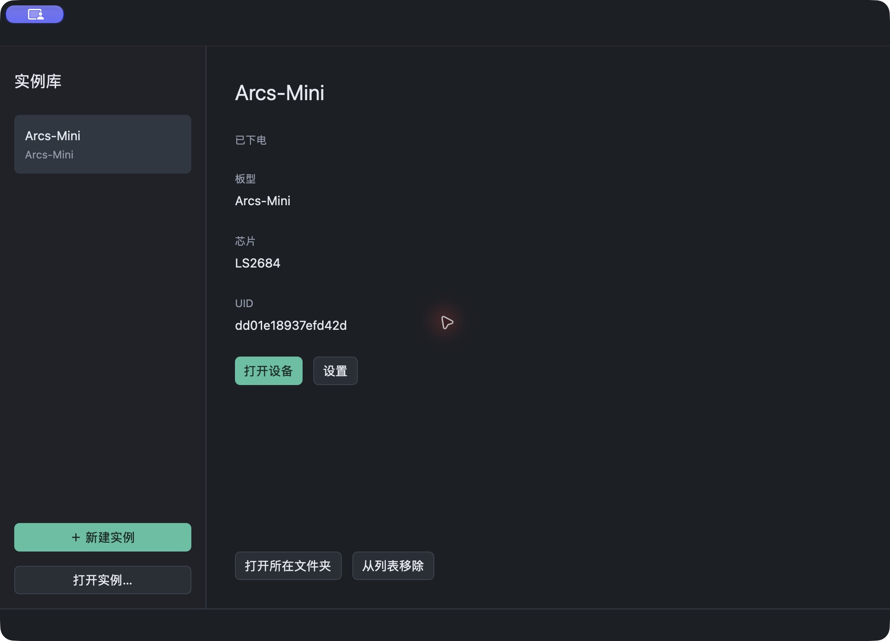

<p align="center">
  
</p>

# Lisem

**在电脑上运行聆思设备固件。**

Lisem 是聆思芯片平台的设备模拟器。导入真机固件，就能在桌面上
查看屏幕、操作按键、连接串口，并通过电脑的麦克风、扬声器和网络与设备交互。
也可以用 `lisem` 命令管理和运行设备，把固件测试放进脚本或 CI。

可在 macOS、Windows 和 Linux 上使用，支持 **LS2684（ARCS）芯片和 Arcs-Mini 板型**。

## 开始使用

从[下载页面](https://github.com/LISTENAI/Lisem/releases)
选择适合操作系统和处理器架构的应用包，解压后打开 Lisem。

macOS 也可以通过 Homebrew 安装：

```sh
brew install --cask listenai/tap/lisem
```

安装后可打开 Lisem，也可在终端直接使用 `lisem` 命令。

### 创建第一台设备

1. 打开 Lisem，点击「新建实例」，选择 **Arcs-Mini**。
2. 导入对应板型的 LPK 固件包，创建实例。
3. 点击「打开设备」，在右上角上电。若固件需要长按开机，按住下方的功能键。

固件包需要自行准备。每台设备的固件、设置和设备身份独立保存，重新打开即可继续使用。



### 与设备交互

- **按键**：鼠标按下与松开分别对应真实按键的按下与松开。
- **声音**：默认播放设备音频；在实例设置中启用麦克风后，可直接用电脑麦克风输入。
- **串口**：先启用 UART 并连接，再上电即可看到启动日志。macOS/Linux 使用
  picocom 等串口工具，Windows 使用 PuTTY 的 Raw TCP 连接。
- **网络**：启用宿主网络后，让固件连接 `Lisem` 热点，即可通过电脑访问网络。
  设备绑定、鉴权和云端服务仍按固件的业务要求配置。

上电、复位、声音和串口入口位于设备窗口右上角。关闭窗口或退出 Lisem 后，
实例继续在后台运行；需要停止时先下电。更多操作见[使用说明](docs/usage.md)。

## 命令行

桌面与 CLI 共用实例库。macOS 的命令位于
`Lisem.app/Contents/MacOS/lisem`；Windows/Linux 位于解压目录中的 `lisem.exe` / `lisem`。
以下用 `lisem` 表示该命令：

```sh
# 创建实例；INSTANCE_ID 使用创建结果中的 ID
lisem create --board arcs-mini --name Mini --lpk firmware.lpk
lisem list

# 在前台运行，适合脚本与 CI
lisem run INSTANCE_ID --seconds 30 --timeout 120

# 后台运行并交互
lisem start INSTANCE_ID --seconds 120 --timeout 180
lisem button INSTANCE_ID function press
# 按需等待，再松开
lisem button INSTANCE_ID function release
lisem screenshot INSTANCE_ID screen.png
lisem reset INSTANCE_ID
lisem stop INSTANCE_ID
```

CLI 默认不启用宿主网络和音频。使用 `--json` 获取结构化结果，使用
`--data-dir` 指定独立实例库。Flash 导入、擦除、UID 管理及其他命令见
[CLI 使用说明](docs/usage.md#无头命令行)或 `lisem --help`。

## 支持范围

可运行 Arcs-Mini 原始固件的显示、按键、存储、LUNA 推理和语音交互流程。
内置芯片 ROM，也支持通过虚拟 UART 执行 ROM 烧录流程。

GC0328 摄像头可选图片作为输入，由原固件配置传感器和 DVP/DMA 采集。
尚不支持宿主实时摄像头、真实手机 BLE 连接、宿主 USB 连接、运行快照和可视化板型编辑。
模拟器侧的逻辑 BLE 配网对端不等同于手机连接；Windows 的 UART 是 TCP 端点，
不能直接交给只接受 COM 串口的烧录工具。Lisem 面向应用运行与调试，不能代替
真机的电气、射频和精确时序验证。

## Coding agent

可通过 `lisem mcp` 接入 MCP，也可让 agent 直接使用 CLI，详见
[接入说明](docs/agents.md)。

## 参与开发

构建依赖、源码结构和验证方法分别见
[开发说明](docs/development.md)与[架构说明](docs/architecture.md)。

```sh
make build
make run
```

问题反馈与功能建议欢迎提交到 [Issues](https://github.com/LISTENAI/Lisem/issues)。

独立自有源码采用 MIT，QEMU 相关代码保留 GPL；LUNA 静态库与芯片 ROM 以
二进制形式随仓库提供，使用单独许可。详见 [LICENSE](LICENSE)。
